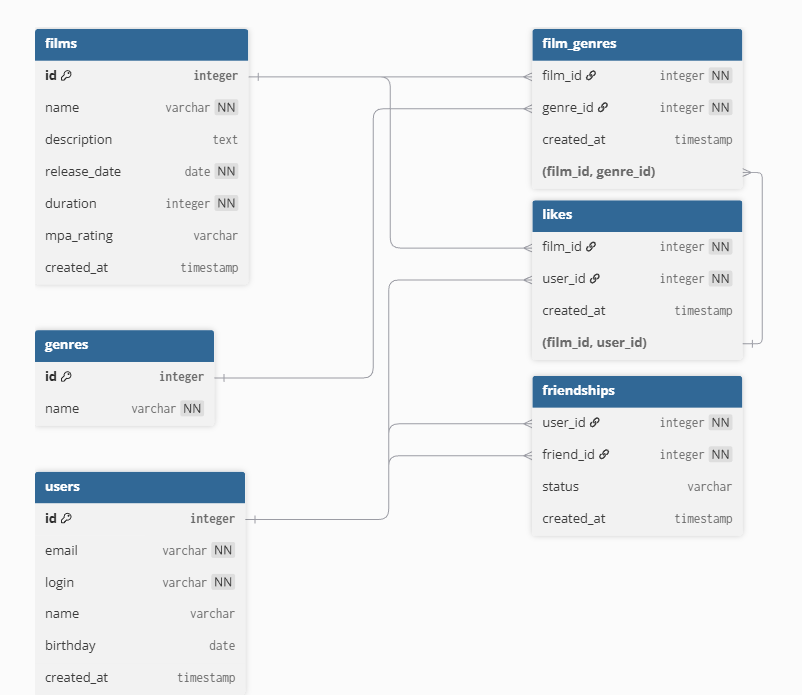

# java-filmorate
Template repository for Filmorate project.

## Database Schema

### ER Diagram



*Рисунок 1: ER-диаграмма базы данных приложения Filmorate*

### Описание таблиц

1. **users** - таблица пользователей
   - `id` - уникальный идентификатор
   - `email` - email пользователя (уникальный)
   - `login` - логин (уникальный)
   - `name` - имя пользователя
   - `birthday` - дата рождения

2. **films** - таблица фильмов
   - `id` - уникальный идентификатор
   - `name` - название фильма
   - `description` - описание фильма
   - `release_date` - дата выхода
   - `duration` - продолжительность в минутах
   - `mpa_rating` - возрастной рейтинг (G, PG, PG-13, R, NC-17)

3. **likes** - таблица лайков (многие-ко-многим)
   - `film_id` - ссылка на фильм
   - `user_id` - ссылка на пользователя
   - `Составной первичный ключ:` - (film_id, user_id)

4. **friendships** - таблица дружеских связей
   - `user_id` - пользователь
   - `friend_id` - друг
   - `status` - статус дружбы ('pending' или 'confirmed')

5. **genres** - таблица жанров
   - `id` - уникальный идентификатор (первичный ключ)
   - `name` - название жанра
    
6. **film_genres** - таблица связи фильмов и жанров
   - `film_id` - ссылка на фильм (внешний ключ)
   - `genre_id` - ссылка на жанр (внешний ключ)
   - `Составной первичный ключ:` - (film_id, genre_id)

#### Основные команды сервисов

### UserService
```java
Collection<User> getAllUsers()
User addUser(User user)
User updateUser(User user)
User getUserById(Long id)
void addFriend(Long userId, Long friendId)
void removeFriend(Long userId, Long friendId)
List<User> getFriends(Long userId)
List<User> getCommonFriends(Long userId1, Long userId2)
void confirmFriendRequest(Long userId, Long friendId)
List<User> getPendingFriendRequest(Long userId)
```
### FilmService
```java
Collection<Film> getAllFilms()
Film addFilm(Film film)
Film updateFilm(Film film)
Film getFilmById(Long id)
void addLike(Long filmId, Long userId)
void removeLike(Long filmId, Long userId)
List<Film> getPopularFilms(Integer count)
int getLikesCount(Long filmId)
void addGenreFromFilm(Long filmId, Genre genre)
void removeGenreFromFilm(Long filmId, Genre genre)
Set<Genre> getFilmGenres(Long filmId)
```
### Операции с пользователями
- `Создание нового пользователя`
```
INSERT INTO users (email, login, name, birthday) 
VALUES ('user@example.com', 'login123', 'Имя Фамилия', '1990-01-01');
```
- `Получение пользователя по ID`
```
SELECT * FROM users WHERE id = 1;
```
- `Получение всех пользователей`
```
SELECT * FROM users ORDER BY id;
```
- `Обновление данных пользователя`
```
UPDATE users 
SET name = 'Новое Имя', email = 'new@example.com'
WHERE id = 1;
```
### Операции с фильмами
- `Создание нового фильма`
```
INSERT INTO films (name, description, release_date, duration, mpa_rating) 
VALUES ('Название фильма', 'Описание фильма', '2023-01-01', 120, 'PG-13');
```
- `Получение фильма по ID`
```
SELECT * FROM films WHERE id = 1;
```
- `Получение всех фильмов`
```
SELECT * FROM films ORDER BY release_date DESC;
```
- `Добавление жанра к фильму`
```
INSERT INTO film_genres (film_id, genre_id) VALUES (1, 1);
```
